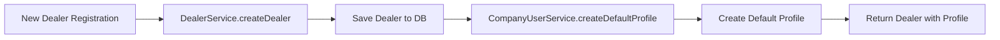

# 🔗 Linking Company-User Module with Dealer Module

## ✅ What Was Done

I've successfully linked the company-user module with the dealer module so that:
- **Default profile is created automatically** when a dealer is registered
- **CompanyUserService** is now available in DealerService
- **Modules are properly connected** via NestJS dependency injection

---

## 📋 Changes Made

### 1. **CompanyUserModule** (`company-user.module.ts`)
```typescript
@Module({
  imports: [TypeOrmModule.forFeature([CompanyUser, Dealer])],
  providers: [CompanyUserService],
  controllers: [CompanyUserController],
  exports: [CompanyUserService], // 👈 ADDED: Export service
})
```
**Why**: Makes `CompanyUserService` available to other modules

---

### 2. **DealerModule** (`dealer.module.ts`)
```typescript
import { CompanyUserModule } from 'src/company-user/company-user.module'; // 👈 ADDED

@Module({
  imports: [
    TypeOrmModule.forFeature([...]),
    CustomMailerModule,
    CompanyUserModule, // 👈 ADDED: Import module
  ],
  ...
})
```
**Why**: Imports CompanyUserModule to access its exported service

---

### 3. **DealerService** (`dealer.service.ts`)

#### 3.1 Import Statement
```typescript
import { CompanyUserService } from 'src/company-user/company-user.service'; // 👈 ADDED
```

#### 3.2 Constructor Injection
```typescript
constructor(
  // ... existing dependencies
  private readonly leadsGateway: LeadsGateway,
  private readonly companyUserService: CompanyUserService, // 👈 ADDED
) {}
```

#### 3.3 Create Default Profile
```typescript
const savedDealer = await this.dealerRepository.save(dealer);

// 👇 ADDED: Create default company user profile
try {
  await this.companyUserService.createDefaultProfile(savedDealer);
  console.log(`✅ Default profile created for dealer ${savedDealer.id}`);
} catch (error) {
  console.error('❌ Failed to create default company profile:', error);
  // Don't fail dealer creation if profile creation fails
}
```

---

### 4. **CompanyUserService** (`company-user.service.ts`)

#### Added New Method
```typescript
/**
 * Create default company user profile for a dealer
 * Called automatically during dealer registration
 */
async createDefaultProfile(dealer: Dealer): Promise<CompanyUser> {
  // Check if default profile already exists
  const existing = await this.companyUserRepo.findOne({
    where: { dealer_id: dealer.id, is_default: true }
  });

  if (existing) {
    console.log(`Default profile already exists for dealer ${dealer.id}`);
    return existing;
  }

  const defaultProfile = this.companyUserRepo.create({
    name: dealer.name,
    email: dealer.contactEmail || dealer.user?.email || `default-${dealer.id}@company.local`,
    phone: null,
    position: 'Owner',
    dealer_id: dealer.id,
    is_default: true,
  });

  console.log(`Creating default profile for dealer ${dealer.id}: ${defaultProfile.name}`);
  return this.companyUserRepo.save(defaultProfile);
}
```

---

## 🔄 How It Works Now



### Flow:
1. Admin registers a new dealer
2. `DealerService.createDealer()` saves the dealer
3. Immediately calls `CompanyUserService.createDefaultProfile()`
4. Default profile is created with:
   - `name`: Dealer's company name
   - `email`: Dealer's contact email (or user email)
   - `position`: "Owner"
   - `is_default`: `true`
5. Dealer registration completes

---

## 🧪 Testing the Integration

### Test 1: Register a New Dealer
```bash
# Via your frontend or API client
POST /dealers
{
  "name": "Test Company",
  "owner": "John Doe",
  "location": "New York",
  "contactEmail": "john@testcompany.com",
  "tierId": 1,
  // ... other fields
}
```

**Expected Result**:
- Dealer created successfully
- Console shows: `✅ Default profile created for dealer {id}`
- Check database: `company_users` table has new record with `is_default = true`

### Test 2: Verify Default Profile
```bash
# Get profiles for dealer
GET /company-users/dealers
Headers: { Authorization: Bearer {dealer_jwt_token} }
```

**Expected Response**:
```json
[
  {
    "id": 1,
    "name": "Test Company",
    "email": "john@testcompany.com",
    "position": "Owner",
    "is_default": true,
    "dealer_id": 1,
    "created_at": "...",
    "updated_at": "..."
  }
]
```

---

## 🎯 What This Enables

Now that the modules are linked:

✅ **Auto-Profile Creation**: Every new dealer gets a default profile
✅ **Service Reusability**: DealerService can use CompanyUserService methods
✅ **Consistent Data**: No dealers without profiles
✅ **Chrome-like Behavior**: Foundation for profile selection system

---

## 🚀 Next Steps

Now that linking is complete, you should:

1. **Test the integration** by creating a new dealer
2. **Create a seeder** for existing dealers (if any don't have profiles)
3. **Implement profile selection** in the frontend
4. **Add profile switching** functionality

Would you like me to:
- Create a seeder for existing dealers?
- Show you how to test this integration?
- Move forward with frontend implementation?

---

## 📝 Summary

The company-user module is now **fully integrated** with the dealer module:

| Before | After |
|--------|-------|
| ❌ No connection between modules | ✅ Modules properly linked |
| ❌ Manual profile creation needed | ✅ Auto-created on dealer registration |
| ❌ CompanyUserService isolated | ✅ Available in DealerService |
| ❌ Inconsistent dealer data | ✅ Every dealer has default profile |

**Result**: Solid foundation for the Chrome-profile system! 🎉
